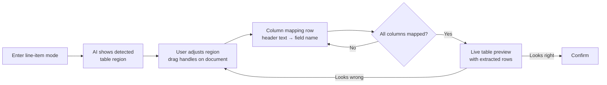
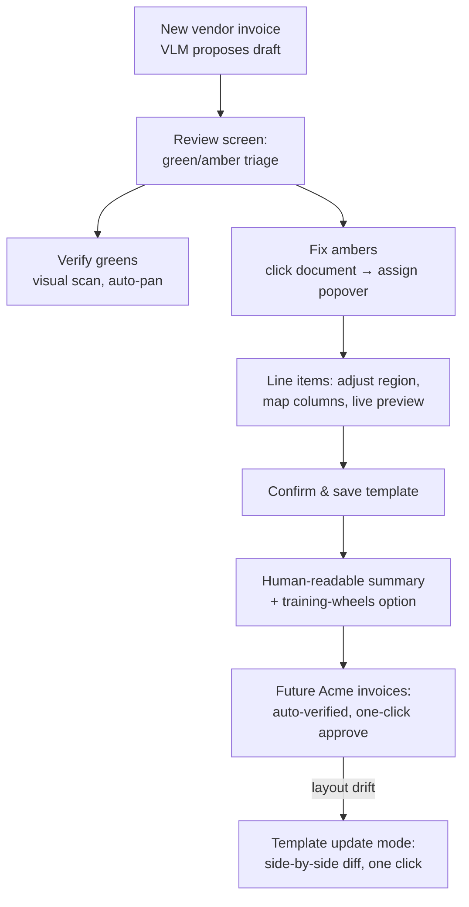

This is the highest-leverage screen in your product — it's not just "verify this invoice," it's **"teach the system once, never do this again."** The UX should make that promise explicit and make the teaching effortless. Here's how I'd design it.

## The mental model to design around

The user is doing two things simultaneously, and the UI should acknowledge both:

1. **Approving this invoice** (today's task)
2. **Creating the template** (every future invoice from this vendor)

Most products only surface #1 and hide #2. That's a mistake — when the user understands that confirming this draft also *automates Acme forever*, they become willing to invest 30 more seconds now. So the screen should say so, explicitly.

## The screen: three panes, not two

```
┌─────────────────────┬──────────────────────────┬───────────────────┐
│                     │  Draft fields            │  Template preview │
│  Invoice document   │                          │                   │
│  (zoomable)         │  Vendor      Acme Corp   │  ┌─────────────┐  │
│                     │  Invoice #   A-0231      │  │ What future  │  │
│  ┌─────────┐        │  Date        12 Apr 2026 │  │ Acme invoices│  │
│  │ ████    │  ←──── │  Total      $2,340.00    │  │ will look    │  │
│  │ region  │        │  ...                     │  │ like after   │  │
│  └─────────┘        │                          │  │ you confirm  │  │
│                     │  [✓ Confirm & Save]      │  └─────────────┘  │
│                     │  [Skip template]         │                   │
└─────────────────────┴──────────────────────────┴──────────────────┘
```

The third pane is the magic. It shows a **ghosted overlay of the template being built**: the regions you've mapped, highlighted on the document. As the user edits mappings, the template preview updates live. When they hit Confirm, there's zero ambiguity about what they just taught the system. This single pane is what turns "I reviewed an invoice" into "I automated a vendor."

## The interaction: click-to-link, in both directions

The core gesture is **linking a field to a region**. Two directions, both must work:

| Direction | Interaction | Use case |
|---|---|---|
| **Field → source** | Click a field in the middle pane → its source region pulses/highlights in the document, and the preview pans/zooms there. | Verifying the AI got it right (the common case). |
| **Region → field** | Click text in the document → a small popover appears: *"Assign to: [Invoice #] [Date] [Total] [Line item: qty] [New field…] [Ignore]"* | Correcting the AI or mapping something it missed. |

The popover is essential. It means the user never has to leave the document to fix a mapping — the whole correction loop is: click wrong value → click right text in the document → done. Two clicks, no forms.

For missed values (AI found nothing for "Date"), the field shows an empty slot with a subtle *"Click the date in the document"* hint — an invitation rather than an error.

### Handling values that need both a key and a value

For a field like `Total: $2,340.00`, the user may need to map the **region** (where the value lives) and optionally an **anchor** (the text "Total" that identifies it). Let the UI infer this:

- If the user selects just the number, auto-detect the nearest label to the left/above ("Total") and propose it as the anchor, shown as a small chip: `anchor: "Total" ✓`.
- Make anchors optional-but-recommended — explain in one tooltip: *"We look for this text on future invoices to find the value — safer if layouts shift slightly."*

This is important because anchors are what make templates robust. A pure coordinate region breaks if the header grows one line; an anchor-based region survives.

## Confidence & progressive disclosure of the fields pane

Don't show 15 fields with equal visual weight — triage attention:

```
  ✓ Vendor        Acme Corp          (high confidence)
  ✓ Invoice #     A-0231             (matched template)
  ✓ Date          12 Apr 2026        (matched template)
  ⚠ Total         $2,340.00          (line items sum to $2,357.50 — check)
  ⚠ Payment terms (empty)            (click value in document)
  ✓ Line items    3 items            (collapsed, "review" link)
```

- **Green rows need a glance, not a click.** Don't make users interact with things that are right — that's the whole point of automation. If every field requires confirmation, you've built a data-entry form with extra steps.
- **Offer a "quick approve"** — if everything is green and totals cross-check, the Confirm button gets a subtle pulse/badge: *"All fields verified — approve in one click."* Optionally, for high-confidence known-vendor reruns, allow auto-approve (with the invoice still appearing in a "Recently auto-approved" list for spot-checking).
- **Amber rows are the work.** Sort them toward the top, or visually elevate them, so the user's eyes land on the 2–3 things that actually need attention.

## Line items — the hard part, worth its own pattern

Line items deserve a distinct sub-mode because they're a repeating structure, not a single field:



Practical details:

- **Drag handles on the document**: the AI proposes the table region (header row + body). The user can drag its edges. Show a live count: *"Region contains 14 rows."*
- **Column mapping as a header strip**: for each detected column, a dropdown of known fields (description, qty, unit price, amount, tax…) plus "ignore" and "custom." One row of decisions, not per-cell mapping. **Never make users map cells individually** — map columns, extract rows automatically.
- **A parsed preview table** next to the document, updated live as the region/columns change. Errors are obvious (misaligned column shows garbage numbers), and the fix is dragging the region edge — visually direct.
- **Handle the classic edge cases**: subtotals and tax rows inside the table region (offer "exclude rows matching 'Subtotal/Tax/Total'" — one toggle); multi-line descriptions (row-merging toggle).

## The moment of confirmation — make the learning explicit

When the user hits **"Confirm & save template"**:

1. **Show what was learned, in one line per field**: *"Invoice # — will look for text near 'Invoice No' in the top-right"* (human-language description of the anchor + region, not coordinates). This makes the template reviewable at the moment of creation, not debuggable later.
2. **A confidence promise**: *"Next Acme invoice: fields auto-verified, you just approve."* You're selling the future payoff at the exact moment it's created.
3. **Graceful escape hatches**:
   - *"Save template, but ask me to confirm the next 2 invoices"* — a training-wheels option for cautious users (and genuinely useful: it validates the template before full trust).
   - *"Approve this invoice only, no template"* — for one-offs (a vendor you'll never see again).
4. **Template versioning from day one**: when a future Acme invoice drifts (anchor moved), the system re-opens this screen in **"template update" mode** — showing old region vs. new location side by side, with *"Acme changed their layout. Update template?"* Users never lose their work; the template evolves with a visible, one-click diff. This is what makes the whole promise durable.

## Small UX details that matter a lot

- **Zoom-to-region on focus**: whenever a field is focused, the document view smoothly pans/zooms to its region. Combined with scroll-linked highlighting, verification becomes visual scanning rather than cross-referencing.
- **Inline editing with validation**: correcting a total by typing? Validate immediately (currency format, sum-check against line items) and show a subtle red border + reason if it fails — don't wait for submit.
- **Undo while mapping**: clicked the wrong assignment? `⌘Z` reverts the last link. Mapping is a fiddly task; make it fearless.
- **The document is always in native resolution** (the actual PDF/image, not a re-render) — users trust what they can zoom into pixel-perfectly.
- **Keyboard flow**: `Tab` cycles through fields (each focus pans the document), `Enter` accepts a field's proposed value, arrow keys to move between candidate assignments. A skilled user should be able to process a brand-new vendor draft in under 30 seconds without touching the mouse.
- **Show the "why" on hover**: each field's confidence badge expands to a tooltip: *"matched anchor 'Invoice No' with 96% confidence"* — explainability builds trust and teaches users when to be skeptical.

## Flow summary



The overarching design goal: **the first invoice costs ~60 seconds, every invoice after costs ~3 seconds, and the user always understands exactly which of those two they're paying for.** Every element above — the third pane, the bidirectional click-linking, the column-level line-item mapping, the explicit confirmation summary, and the drift-update mode — exists to serve that bargain.