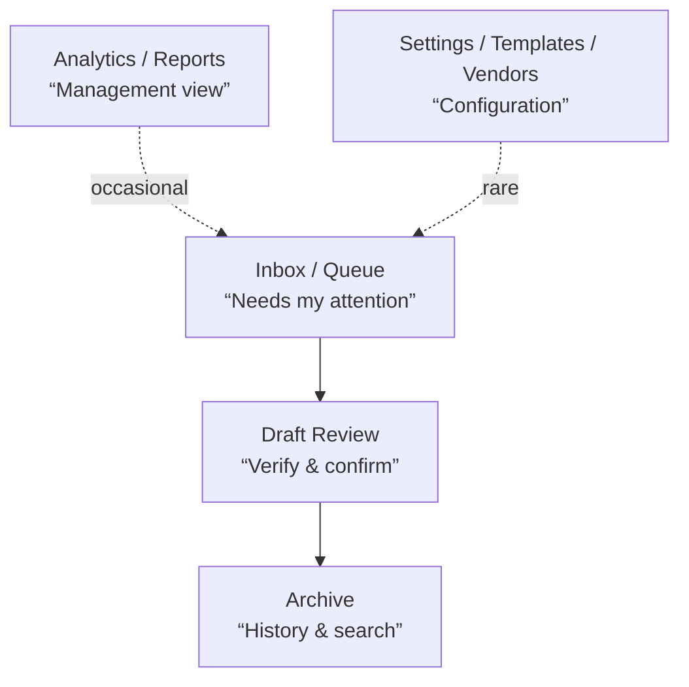

## 1. Information architecture — three zones, not one dashboard

Most AP software dumps everything into one cluttered dashboard. Instead, structure around the user's actual mental model:



- **Inbox** is the default landing screen — sorted by urgency/SLA, not alphabetically. This screen should answer "what do I need to do right now?" in one glance.
- **Archive** is powerful search-first, not folder-driven (see search below).
- **Analytics** is a separate, calmer surface — visited weekly by managers, not daily by processors.

## 2. The review screen — your most important screen

This is where users spend 80% of their time. Design it as a **side-by-side split**:

```
┌──────────────────────┬──────────────────────────┐
│                      │  Extracted fields        │
│   Invoice preview    │  ┌────────────────────┐  │
│   (PDF/image with    │  │ Vendor    ✓ Acme   │  │
│    highlighted       │  │ Date      ✓ 12/04  │  │
│    regions)          │  │ Total     ⚠ 2,340  │  │
│                      │  │ Invoice#  ✓ A-0231 │  │
│  Zoom/pan, page      │  └────────────────────┘  │
│  nav, fit-to-region  │  [Approve] [Edit] [Skip] │
└──────────────────────┴──────────────────────────┘
```

The critical details:

| Element | UX detail | Why |
|---|---|---|
| **Highlight-validated regions** | When a field is confirmed, draw a box around the source region in the document preview. Click a field → its source location highlights and the preview pans/zooms to it. | This is **the** trust-builder. Users verify by looking, not by reading JSON. It also makes errors obvious in one glance. |
| **Confidence coloring** | ✓ green (high confidence, matched template), ⚠ amber (low confidence or new vendor), ✗ red (conflict — e.g., sum of line items ≠ total). | Users triage by scanning for amber/red, not by reading every field. |
| **Field-level edit inline** | Click any value → edit in place → auto-verify against the source region. No modal dialogs for edits. | Speed for the common case. |
| **Auto-calculated cross-checks** | Line items sum vs. total, tax math, currency consistency — show a subtle "✓ totals verified" or "⚠ line items don't sum to total." | Catches extraction errors the model missed; shows your software is smart, not just a transcriber. |
| **Approve as primary action** | Big, always-visible button (with keyboard shortcut A). Secondary: Edit, Skip/Reject. | Makes the happy path one action away. |
| **Next-in-queue preview** | On approve, animate the next invoice in. Don't bounce back to a list and make the user click again. | Keeps a processing rhythm — this is the single biggest throughput win. |

## 3. The queue/list — keyboard-first

AP processors handle 50–200 invoices a day. Design the list like an email client, not a table on a website:

- **Keyboard shortcuts, documented inline**: `J/K` or `↑↓` to navigate, `Enter` to open, `A` to approve, `R` to reject, `?` to show the shortcut overlay. Show a small hint bar at the bottom at first, dismissible.
- **Row density options** (compact/comfortable) — finance people love dense tables.
- **Inline status with counts**: tabs or filter chips — `Needs review (14) · Awaiting approval (6) · Ready to sync (23) · Exceptions (3)` — with the number making the queue feel finite and progress feel real.
- **Skeleton rows** for background-processing invoices (ties into the async flow we discussed — the invoice exists in the list immediately, in a "processing" state).
- **Batch selection** with sticky bulk actions bar: approve all, reassign, export.
- **Quick-assign**: drag a row onto a teammate's avatar in the sidebar to reassign. Faster than an assignee dropdown.

## 4. Search & the command palette (⌘K)

- **Command palette** for everything: `⌘K` → type "acme 2300" → jump to that invoice; "reassign to Sarah"; "export this month." Power users live here.
- **Archive search should be structured-aware**: search by vendor, amount range, date range, status, *and* full-text search inside extracted content. The answer to "what did we pay Acme for in March?" should be one query, not a filter-building exercise.
- **Saved views** — "My exceptions," "Overdue > 5 days" — with optional email digest.

## 5. Onboarding & empty states

- **Empty states that teach**: instead of "No invoices yet," show a drop zone with "Drop an invoice here or forward to invoices@yourcompany.acme.app" with a mini diagram of what happens next.
- **First-invoice guided flow**: the first upload walks through extraction → draft confirmation → template creation with a short explainer ("Confirm this draft once — every future Acme invoice will be instant"). Sets the expectation *and* sells the magic.
- **Template health list** in settings: each vendor template with usage count, confidence trend, last-used date, and a "needs re-training" flag if match rates dropped. Gives admins a maintenance surface without feeling like debugging.

## 6. Visual design specifics

- **Money is monospaced, right-aligned, tabular numerals.** `1,234.56` columns must line up perfectly. Non-negotiable for a finance product.
- **Currency always visible** when multi-currency is possible — ambiguity here causes real errors.
- **Dates in one consistent, unambiguous format** (`12 Apr 2026`) everywhere. ISO for exports, human-readable in UI.
- **Color as signal, not decoration**: reserve red/amber/green strictly for status/confidence. Everything else is neutral. Finance users need to trust color meaning instantly.
- **Dark mode** — processors stare at this for hours; it's a cheap win and users will ask anyway.
- **Responsive, but honest**: desktop is the workstation. Mobile gets a dedicated, focused experience (next point), not a squeezed-down dashboard.

## 7. Mobile — approvals only, done well

Don't try to replicate the full app. One job: **"I'm a manager, 6 invoices need my approval, I'm in line at the airport."**

- Card per invoice: vendor, amount, date, one thumbnail, "why flagged" if flagged.
- Tap → expand to full detail with the same side-by-side validate layout (fields + document image).
- Swipe or big-button Approve/Reject with optional voice-dictated comment.
- **Biometric confirm for high-value invoices** (face/touch ID above a configurable threshold) — security teams love this, users find it natural.
- Push notification with a digest: "6 invoices need approval · 2 over $10k" rather than per-invoice spam.

## 8. Micro-interactions that build trust

- **Processing timeline** per invoice: Received → Extracted (1.2s) → Awaiting approval (3 days) → Synced to ERP. Visible on every invoice. Turns your pipeline into transparency rather than a black box, and helps users locate stuck items.
- **Undo everywhere** — approve by accident? `⌘Z` or a 5-second undo toast. Cheap to build, removes fear of fast actions.
- **Optimistic UI for approvals** — the row animates out immediately; a small background indicator shows sync to ERP. If sync fails, the row returns with an error state rather than blocking the user.
- **Toasts with actions**, not just info: "Invoice synced to NetSuite ✓ [View in NetSuite]" — deep-linking into the ERP record closes the loop and proves the integration works.

## 9. Error & exception states (where most products fail)

- **"Extraction failed" should always offer three paths**: Retry, Review manually anyway (let them type the fields by hand — never dead-end), and Report problem (with the image attached for your team).
- **Validation errors in human language**: "This invoice total doesn't match the sum of its line items ($2,340.00 vs $2,357.50)" — not "Validation error code 4."
- **Exception queue is a first-class screen**, not a filter hidden in settings. Give it its own triage UX: bulk "mark as duplicate," quick vendor-correction, and a shortcut to re-run extraction after a template fix.
