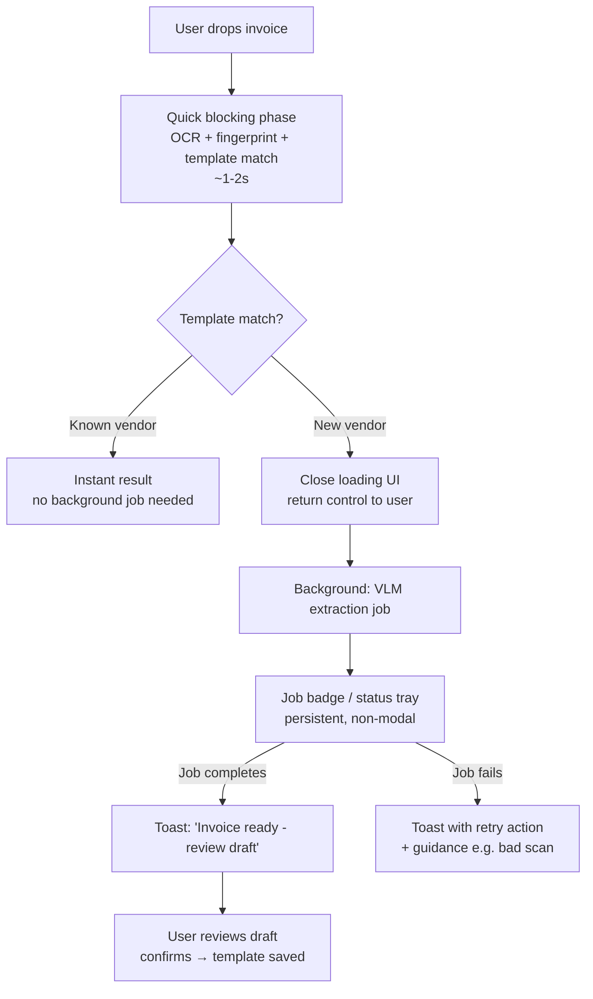

Yes — that's the right instinct, and it's the standard pattern for document processing products. But there's one important refinement: **toasts are the wrong primary UI for anything that takes 10+ seconds or has failure states**. The better shape is: short blocking phase for OCR/skeleton → background job → persistent, non-blocking status. Let me break it down.

## The core problem with your current flow

A full-screen loading modal for 30 seconds means:

- The user can't do *anything* — can't fix a typo, upload the next invoice, or leave
- If it fails at second 28, they lost 30s of patience and have zero partial results
- It *feels* slower than it is, because there's no perceived progress or control
- Batch uploads become brutal (5 invoices × 30s = 2.5 min of staring)

## Recommended flow: quick block, then background

This maps perfectly onto the template-learning pipeline we discussed: the **fast path (known vendor) is genuinely instant**, so most uploads complete before you'd even show a background job. The VLM fallback is exactly the thing that should run in the background — it's slow, it's rare (once per vendor), and its output needs human review anyway (Draft), so there's no reason to hold the UI hostage.

## Toasts vs. a persistent job status — use both, for different things

| UI element | Use for | Why |
|---|---|---|
| **Toast** | Completion notification, failure alert | Transient, attention-grabbing, right for "it's done, act now" |
| **Status badge / tray** (small spinner in header, or "1 invoice processing" chip) | The ongoing job itself | Toasts auto-dismiss — a 30s job needs a durable indicator the user can check anytime |

The failure mode of toast-only: your VLM job takes 30s, the toast for "processing started" disappears after 5s, and the user thinks the app lost their invoice. A persistent badge (even just `⟳ 1 processing` in the nav bar) solves that and scales to batch uploads (`⟳ 4 processing`).

## Details that matter for this specific flow

**1. Stage the progress, don't fake it.** If you do show progress, tie it to real pipeline stages — "Reading page" → "Matching vendor" → "Extracting fields" — rather than a fake 30-second progress bar. Users trust stage labels; fake linear progress that jumps erratically is worse than a spinner.

**2. Keep the upload visible and actionable.** The invoice should appear in a list immediately in a "Processing…" state (skeleton row with a shimmer/spinner), not vanish into a void. This gives the user a mental model: *the thing exists, it's working, I can do other stuff.* When done, the row flips to "Draft ready → review". This is how email attachments and Slack uploads behave — a known, trusted pattern.

**3. Make completion land somewhere.** A toast alone asks "did you see me?" Better: toast **plus** a subtle state change on the row (notification dot, badge count on a "Drafts" tab). If the user misses the toast, the state change catches them.

**4. Allow parallel work.** The moment the modal is gone, users can upload the next invoice while the first one processes. Make sure your pipeline actually queues/concurrent-processes rather than serializing — otherwise you've just hidden the wait, not removed it, and invoice #3 in a batch is still 90 seconds away.

**5. Handle the failure path gracefully.** VLM extraction on a blurry scan can fail or produce garbage. The background job should end in a clear state: "Couldn't extract — check scan quality / Retry / Extract manually". Never leave a job badge spinning forever; add a timeout + failure state.

**6. Onboarding edge case: the very first invoice.** For a new user, invoice #1 is always the slow VLM path. Consider making *that one* a deliberately guided experience (full-screen with a visible explanation: "First time seeing this vendor — creating a template, this takes ~30s. Future invoices from them will be instant."). It sets the expectation correctly and even sells the speed benefit.

## TL;DR

- ✅ Short blocking phase (~1–2s: OCR + template match) is fine — under ~2s, modals don't hurt
- ✅ Close it and run the VLM/Draft phase in the background
- ⚠️ Don't use a toast as the *only* live indicator — add a persistent job badge or skeleton list row
- ✅ Toast on completion → takes user to the Draft review screen
- ✅ With the template pipeline, most invoices (known vendors) never need the background phase at all — which turns your UX problem into mostly a non-problem

The general principle: **block only when the user can't meaningfully proceed without the result, and for only as long as attention naturally holds (~2s)**. Everything else becomes a durable background state the user can check on their own schedule.